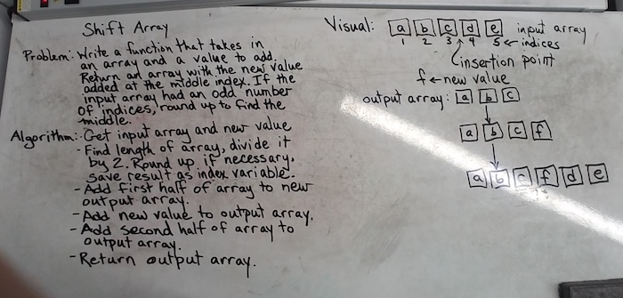
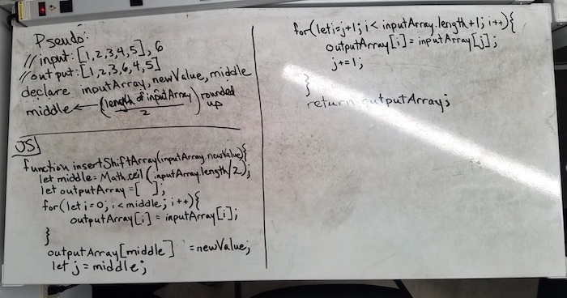

# Insert and shift middle index of array
Write a function to take in an array and a new value. Return the input array with the new element inserted at the middle index. If the input array had an odd number of indices, round up to find the middle .

