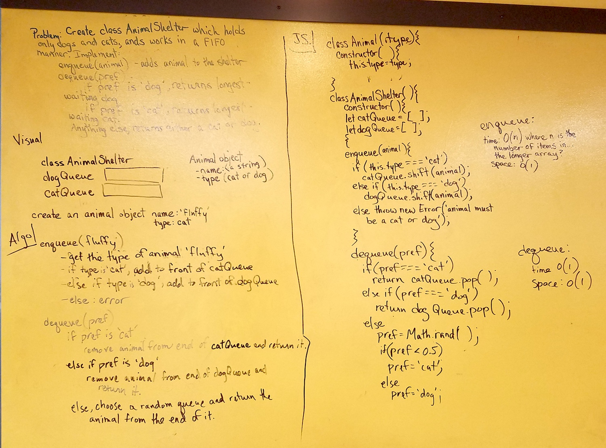

Create a class called AnimalShelter which holds dogs and cats, and works in a first-in-first-out manner. Add an enqueue(animal) method to add an animal object to the shelter, and a dequeue(pref) method that returns the longest-waiting cat if passed 'cat' preference, longest-waiting dog if passed 'dog' preference, and either a dog or cat for any other preference.

