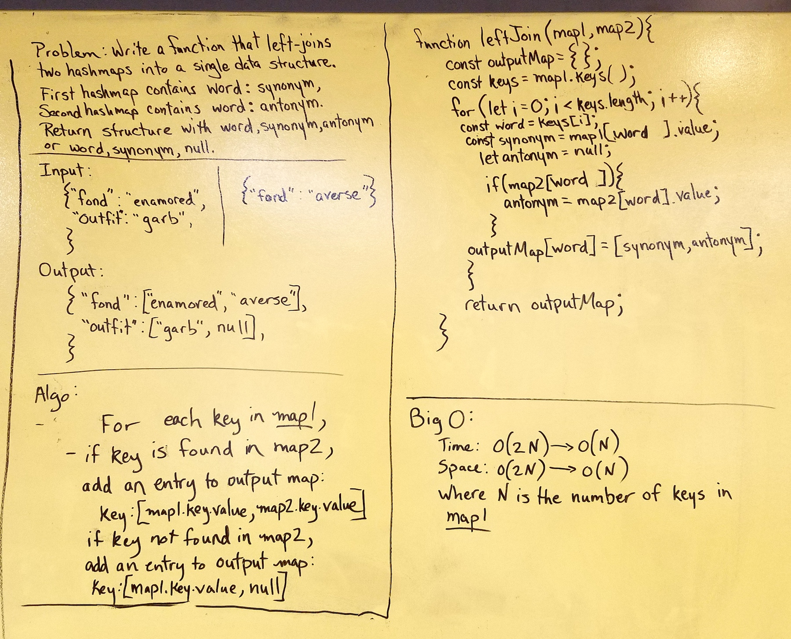

# Left Join Two Hashmaps
Write a function to left-join two hashmaps into a single data structure.
The first hashmap contains entries with the pattern word : synonym.
The second hasmap contains entries with the pattern
word : antonym.
Return a structure containing entries with the pattern
word, synonym, antonym, if the word is found in both maps,  or word, synonym, null if the word is not found in the second map.
## Solution

