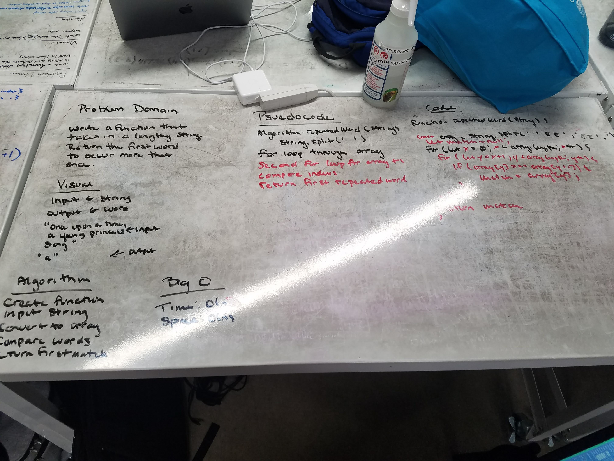

# Repeated-word
Write a function that takes in a lengthy string and returns the first word to occur more than once.

## Challenge
Write a function that accepts a lengthy string parameter.
Without utilizing any of the built-in library methods available to your language, return the first word to occur more than once in that provided string.

## Solution
