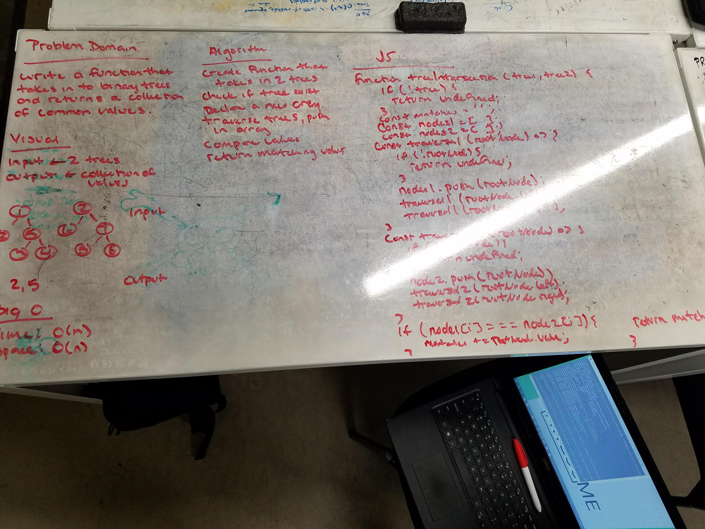

# Tree Intersesction
Write a function that takes in two trees and returns an array of the matched values.

## Challenge
Write a function called tree_intersection that takes two binary tree parameters.
Without utilizing any of the built-in library methods available to your language, return a set of values found in both trees.

## Solution
